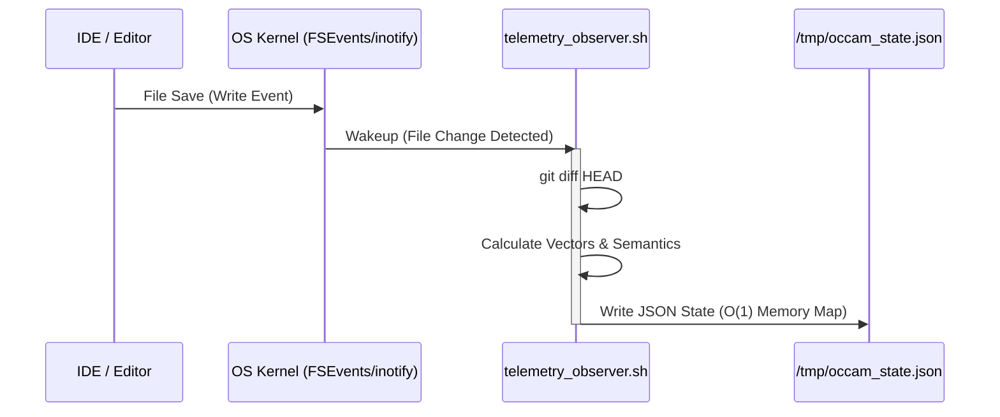

# Occam Observer

> *An Out-of-Band, Event-Driven Git Telemetry Daemon.*

Occam Observer is a zero-dependency, ultra-fast background daemon that monitors a Git repository from the outside. It tracks uncommitted work in real-time, calculates the vector of code changes (integrity, mass, entropy, testing, and tech debt), and exposes this telemetry via a high-performance local CQRS API server and a modern React/Vite Dashboard.

**No Node.js. No Python. No Go. Pure Bash & Awk.** (Engine)
**Fast React & Tailwind UI** (Dashboard)

## Architectural Principle

**Occam's Razor**: Zero heavy dependencies. Uses strictly POSIX-compliant standard Unix tools (`awk`, `sed`, `grep`, `nc`) for the core engine.

The system implements an **Out-of-Band (OOB) Observer** pattern: it runs in a separate terminal process and uses `git -C <path>` to analyze the repository state without interfering with the developer's primary workspace.



## Requirements

| OS       | Required Tool    | Installation                           |
|----------|------------------|----------------------------------------|
| macOS    | `fswatch`        | `brew install fswatch`                 |
| Linux    | `inotifywait`    | `sudo apt-get install inotify-tools`   |
| Both     | `git` ≥ 2.x      | preinstalled / `brew install git`      |

> **macOS Note**: The script automatically detects Homebrew in `/opt/homebrew` (Apple Silicon) and `/usr/local` (Intel) without requiring manual `PATH` exports.

## Installation

```bash
git clone https://github.com/fabriziosalmi/occam-observer.git
cd occam-observer
chmod +x telemetry_observer.sh
```

## Usage

```bash
# Basic startup — uses target_path from config/main.yml
./telemetry_observer.sh

# Target override via CLI (highest priority)
./telemetry_observer.sh /absolute/path/to/repo

# Explicit config file
./telemetry_observer.sh --config /path/my-config.yml

# Help
./telemetry_observer.sh --help
```

## Deep Intelligence Engine (v3.0)

Metrics are calculated **only on added lines** (`git diff HEAD`) in O(N) linear time, skipping compilation or AST parsing. 

In addition to base metrics (Security, Mass, Entropy, Testing, Debt), Occam extracts **Deep Semantic Mappings**:
- **Infrastructure Changes**: Detects modifications to Dockerfiles, CI/CD pipelines, k8s manifests.
- **Schema Mutations**: Detects database schema or ORM modifications.
- **Network Outbound**: Captures network calls (fetch, axios, http.Get).
- **Signatures Added**: Indexes newly written functions and classes.
- **Dependencies**: Identifies `import`, `require`, `go get`, or `pip install` modifications.

## Go API Gateway & Web Dashboard

Occam Observer pairs its shell-based engine with an ultra-fast **Go API Gateway** (`api/main.go`). It serves a zero-latency memory-mapped cache and a beautiful React+Tailwind UI.

### Headless Mode (`--json`)
You can use the engine programmatically without the background watcher:
```bash
./telemetry_observer.sh --json /absolute/path/to/repo
```
This performs a synchronous, one-shot analysis and prints the JSON vector directly to `stdout`.

### REST Endpoints
When you launch the main observer (`./telemetry_observer.sh`), it automatically spawns the Go API Server on `127.0.0.1:9999`.

- **`GET /` (CQRS Read Model)**
  Returns the exact current state of the actively watched repository with **O(1) read latency**.
  ```bash
  curl http://127.0.0.1:9999/
  ```

- **`GET /analyze?path=/xyz` (On-Demand Compute)**
  Runs a synchronous, isolated analysis on the requested path using the `--json` headless mode.
  ```bash
  curl "http://127.0.0.1:9999/analyze?path=/Users/fab/Documents/git/gitoma"
  ```

### Dashboard UI
Access the Shadcn-style React Dashboard by navigating to:
```text
http://127.0.0.1:9999/ui/
```

## Documentation

Full documentation is available in the `/docs` directory (built with VitePress).
To view the docs locally:
```bash
cd docs
npm run docs:dev
```

## License

MIT
